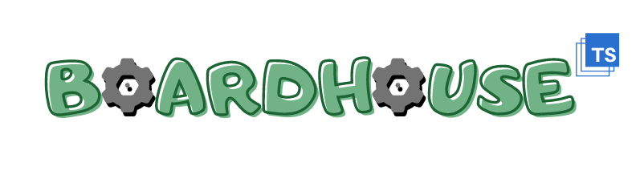

<!--lint disable no-literal-urls-->
<p align="center">
    <a href="https://jjwall.github.io/BoardhouseTS/">
        
    </a>
</p>

This is a game framework / engine written in TypeScript to rapidly develop prototypes.

### Includes:

* Three.js rendering library
* Event pump for updating and rendering game objects
* State system for managing menu / game / scene states
* Entity-component system
* Simple animation engine (swaps out textures)
* Texture, audio, and font loaders
* React-like UI layer
* And much more!

### To-Do:
See [TODO.md](TODO.md) for current list of features to be implemented.

___
### Build Instructions:
```
npm install
```

##### Development:
```
npm start
```

##### Production:
```
npm run build
node server.js
```

Go to ``localhost:8080`` to test it out. All production files will be contained in the ``dist`` folder.
___

### FAQ:
#### Q: How do I pull in as a package.json dependency?
A: The API is being fleshed out and I will bundle up the core features as an npm package once finished.

#### Q: How do I use it?
A: Once the project is considered "feature complete" I will add a wiki detailing the steps to get a simple project started using the framework.