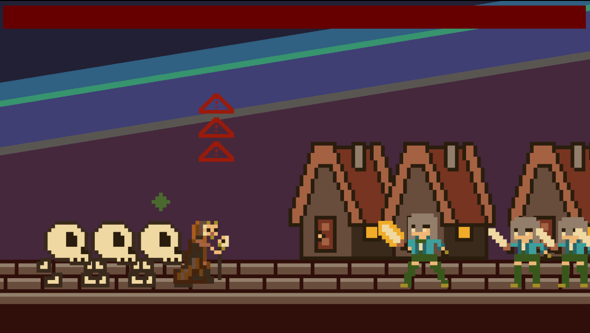

# BoardhouseTS
{: .no_toc .fs-9 }

BoardhouseTS is a game engine written in TypeScript to rapidly develop prototypes.
{: .fs-6 .fw-300 }

## Table of contents
{: .no_toc .text-delta }

1. TOC
{:toc}

[See Examples](#examples){: .btn .btn-primary .fs-5 .mb-4 .mb-md-0 .mr-2 } [Build Instructions](https://jjwall.github.io/BoardhouseTS/build.html){: .btn .fs-5 .mb-4 .mb-md-0 }

## Examples
{: .no_toc }
The following are games that were developed using some iteration of Boardhouse:

### **Ludum Dare 43: Creatures of the Night**

    

* Play it here: [https://gizmolo.itch.io/creatures-of-the-night](https://github.com/jjwall/)
* Ludum Dare submission: [https://ldjam.com/events/ludum-dare/43/creatures-of-the-night](https://ldjam.com/events/ludum-dare/43/creatures-of-the-night)
* Source code: [https://github.com/jjwall/LD43](https://github.com/jjwall/LD43)

Developed by:

* [jjwall](https://github.com/jjwall/) - **Jacob Wallace**

### **Global Game Jam 2019: Pale Blue Dot**

    

* Play it here: [https://wiredoverload.itch.io/pale-blue-dot](https://wiredoverload.itch.io/pale-blue-dot)
* Global Game Jam submission: [https://globalgamejam.org/2019/games/pale-blue-dot-2](https://globalgamejam.org/2019/games/pale-blue-dot-2)
* Source code: [https://github.com/WiredOverload/PaleBlueDot](https://github.com/WiredOverload/PaleBlueDot)